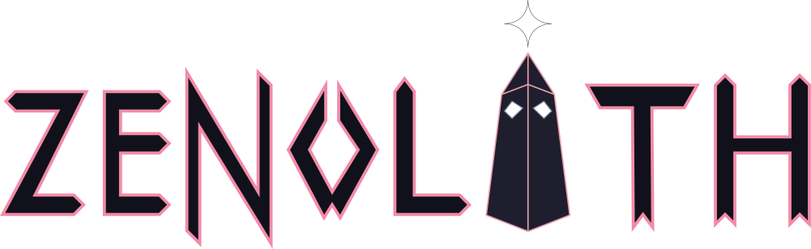

# Zenolith

Zenolith is my attempt at a retained-mode, platform-agnostic, zig-native GUI engine.

**[Join the Matrix room here!](https://matrix.to/#/#zenolith:mzte.de)**

Warning: Zenolith is in an extremely early stage! Many important features such as text editing
are not yet implemented. Expect breaking changes!

## Attention GitHub users!

Zenolith is mirrored on GitHub to make it easier to discover, however, this mirror is read-only!
Do not open issues or pull requests on GitHub!
All development happens on [MZTE Git](https://git.mzte.de/zenolith/zenolith).

## Contributing

Pull requests are always welcome! If you'd like to fix a bug, improve documentation or implement
a feature on the TODO list below, go ahead!
If you'd like to suggest a new feature or design change, please open an issue first to discuss it!

**All commits must follow [Conventional Commits](https://www.conventionalcommits.org/)!**

## TODO

- [x] Painter API
  - [x] Rectangles
  - [x] Textures
  - [x] Text
    - [x] Multi-Color chunks
    - [x] Multi-Font chunks
  - [ ] Triangles
  - [ ] Matrix Transformations?
  - [ ] Drawing of partial widgets
    - [ ] stencils?
- [x] Widgets
  - [x] Box (FlowBox-like algorithm)
  - [x] Button
  - [x] Label
    - [ ] Word Wrapping
    - [ ] Character Wrapping
    - [ ] Ellipsization
  - [ ] Text Edit
  - [ ] Tabbed Pane
  - [ ] Split Pane
  - [ ] Scrolled Pane
- [ ] Focus System
- [x] Theming
  - [ ] Built-in themes
- [ ] Layout overflow handling
- [x] Logo
- [x] Treevents (Tree-Bound, downwards events)
- [x] Backevents (Tree-Bound, upwards events)
- [x] Platform events (Platform event loop events)
  - [x] Wrap Backevents
- [x] Attreebutes (Tree-Bound, inhereted widget properties)
- [ ] Documentation
  - [x] In-Code
  - [ ] Book
  - [ ] Examples
- [ ] CI/CD
- [x] [SDL2 Backend](https://git.mzte.de/zenolith/zenolith-sdl2)
- [ ] Mach Backend
- [ ] TUI Backend
- [ ] WASM Backend
- [ ] Lazy rendering of subtrees

## Gallery

